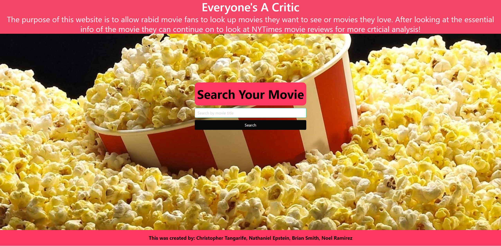

# Everyone's A Critic #

  ## Table of Contents
* [Description](#description)
* [Usage](#usage)
* [License](#license)
* [Contributors](#contributors)
* [Questions](#questions)

## Description
Everyone's a Critic is a website that will movie enthusiasts or the average movie-goer can visit to find reviews about a number of movies they are interested. By asking the user to input the movie title and the year (if they choose) they will be populated with movie results matching their criteria. 
## Usage
People can use "Everyone's A Critic" to find out about if a movie they are interested in going to see is worth seeing. They can find a review of the movie on our site.
## License

Copyright (c) [2021] [Christopher Tangarife, Nathaniel Epstein, Brian Smith, Noel Ramirez]
## Contributors
Christopher Tangarife, Nathaniel Epstein, Brian Smith, and Noel Ramirez
## Questions
If you have any questions about the application contact us via our Github Profiles
# Contact
Chris: Christangarife95@gmail.com , 
Brian: bjtsmith23@gmail.com , 
Nathaniel: nathaniel.epstein@gmail.com , 
Noel: rnoel2125@gmail.com.

# Username
Check out our other works on our respective github profiles: [Chris](https://github.com/ChrisCodes54) , 
[Nathaniel](https://github.com/natpitt2393) , 
[Brian](https://github.com/bjtsmith23) , 
[Noel](https://github.com/Namagaii).
# Screenshots

